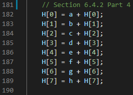

<h1 align="center">Theory-of-Algorithms: SHA-512 Algorithm</h1>


# Project Details
| **Project Title** | SHA-512 Algorithm |
| :------------- |:-------------|
| **Course**              | BSc (Hons) in Software Development |
| **Module**              | Theory of Algorithms |
| **Institute**           | [Galway-Mayo Institute of Technology](https://www.gmit.ie/) |
| **Student**             | [Neil Byrne](https://github.com/NeilByrne97) |
| **Module Lecturer**      | [Ian McLoughlin](https://github.com/ianmcloughlin/) |

***


## Introduction to SHA512
The National Institute of Standards and Technology (NIST) have a suite of hash algorithms under the
Secure Hash Standard (SHS) [1]. The one being discussed and implemented here is SHA-512 which is part
of a group of hashing algorithms called SHA-2. This algorithm is an iterative, one-way hash function
that takes an input string of any length and produce a fixed length string called a message digest.
The key feature of the algorithm is that it is pseudo random and any slight change to the message
will, with a very high probability, result in a completely different message digest. That is to say
that every possible message digest has the same probability to be produced for any given input string.
This algorithm like all other hash function is Collision Resistant: It is not feasible to
find two distinct input strings that produce the same message digest.
While this is algorithm is not useful with encryption it is excellent to verify that digital
signatures on certificates haven't been changed, message authentication, and to generate what
appears to be random bits. More recently it's used on blockchain for Bitcoin.

 
# How the program works
Under the standard, each algorithm has it's own basic properties. The table below is the basic properties for SHA-512.

| Algorithm | Message Size (bits) | Block Size (bits) | Word Size (bits) | Message Digest Size (bits) |
| --------- | ------------------- | ----------------- | ---------------- | -------------------------- |
| SHA-512   | <2<sup>128</sup>    | 1024              | 64               | 512                        |

## Functions and Constants
Preset functions and contstants must be set before any computation is made. While the functions for all SHA hashes are the similar, they each have different discriptions.


The constants are the first 64 bits of the frational parts of the cube roos of the first 80 prime numbers.


## Preprocessing
Certain steps must be taken before an input can be put through the hash. Each of these steps are outlined in Section 5 Preprocessing.

### 1. Padding The Message
The reason for padding is to ensure that the message is a multiple of 1024 bits
* Append "1" bit to the end. - This shows the computer where the padding begins.
* Add "0"s until there is 128 bits at the end. - 128 is left for the length of the message
* Append and encode the last 128 bits in binary big-endian. - 


### Edge Cases
If we don't have enough bits left for padding at the end of the block.
* Create a new message block.
* Fill it with just padding..

If the file is exactly 1028 bits.
* Create another message block for the first padding bit "1".
* Add the "0" bits.
* The last 128 bits is the number of bits in the orignal file.


### 2. Parse message into the message blocks
Once padded the message must be broke into blocks of 1024 bits


### 3. Set initial hash value
Before the hash computation begins and initial hash value H(0) must be set to a 64 bit word. _These words were obtained
by taking the first sixty-four bits of the fractional parts of the square root of the first eight prime numbers_ [1].


## SHA-512 Hash Computation
### Prepare the Message Schedule

Each Message block _M<sub>(1)</sub>, M<sub>(2)</sub>,.... M<sub>(N)</sub>_ is processed in order using the steps defined below:
1. Prepare message schedule _W<sup>(t)</sup>_ 


2. Initialze the eight working variables _a, b, c, d, e, f, g, h_ with their specified hash value


3. For t=0 to 79  create new values for working variables.


4. Compute the _i<sup>th</sup>_ intermediate hash value _H<sup>(i)</sup>_:




## Running The Programme
### Environment
The only requirements to run this programme is a C compiler.

### Download
- Clone the repository
- CD into the directory
```bash
$ git clone https://github.com/NeilByrne97/theory-algos-project
```

### Compile
- CD into the cloned repository
```bash
$ gcc -o sha512 sha512.c
$ ./sha512
```

### Execute
The programme can be executed in 3 different methods.
1. Enter fileName.txt in the command line. 
2. Enter fileName.txt at runtime.
3. Enter a string at runtime.

#### Command line argument
```bash
$ ./sha512 filename.txt
```


#### Runtime (File input)
```bash 
$ ./sha512
$ 1
$ fileName.txt
```


#### Runtime (String Input)
```bash 
$ ./sha512
$ 2
$ abc
```


-----

# Tests
This is a series of tests to ensure that the algoithm is working correctly. The message digests are checked against an online SHA-512 hash programme [14].

### abcdefghijk


### G00343624


### "" (Empty String)


### Long String


-----


# Questions
### 1. Why can't we reverse the SHA512 algorithm to retrieve the original message from a hash digest?
The idea of hashes is that they are irreversible. A good hash algorithm is much simpler going forwards than backwards [5]. Unlike encryption algorithms which require you to be able to retrieve the value back (to decrypt) with a known key. There is no known key to reverse a hash.

Since we do not need to reverse the hash we can lose some information about the original message. The hash will break the input string and performed bit operations. All the addition within the algorithm is done without any overflow modulo 2<sup>64</sup> . Modulo can be imagined as a clock face that goes from 0 to N. Meaning everything between 0 and N is modular N. If an arithmetic is performed with modular N, no matter the size of it. You will simply go around the clock face.  In the scenario below N=17, there is no real way to determine where the answer will land on the clock [3].


Even if you know the position of your answer on the clock you still don't know how many times that calculation went around the clock to get there. The only way to solve these equations is with brute force for an infeasible amount of time. 


The SHA-512 hash will always produce a 512 bit message digest.
In order to produce a known length message digest of any size, some data will be lost. The input can be any length but the length of the output is set by the algorithm,512 bits. If the input message is 5120 bits long, x10 bigger than the message digest. How can it be possible to store **more** data in **less** memory? If it was possible then all data in the world could be encrypted to a fraction of it's original size without losing data. So, a lot of data is lost making it impossible to determine the original data with just resulting hash [4].
If you reach the 64 bit maximum word size then you simply wrap back around (like on the clock) again losing information.

### 2. Can you design an algorithm that, given enough time, will find input messages that give each of the possible 512-bit strings?
While there is an infinite about of inputs of varying length to put through SHA512, there is only <2512 possible outputs. This is known as the pigeonhole principle. If n items are put into m containers and n>m. Then at least one of the containers must contain more than one item. Inevitably there are some hashes that could be derived from two distinct input strings. Given the output of a SHA512, it is NOT possible to unambiguously recover the original input used. But given enough time it is possible to compute an input which yields the same output. This is called a Hash Collision. 

A requirement for all hash algorithms is to make this inevitability to be astronomically unlikely. The probability for a collision in SHA512 is <1.4x1077 [6]. Collision resistance does not mean that no collisions exist, only that they are extremely hard to find. Pre-image attacks are an attempt to find an input that has a specific hash value. Older hash algorithms such as MD5 are now broken because of the increase in computing power and can be cracked with this kind of attack.
#### If hashing b-bit inputs to n-bit digest, how many pre-images per digest on average?

2<sup>b</sup> pre-images "placed in" 2<sup>n</sup> pre-image containers

One digest must have at least 2<sup>b</sup> / 2<sup>n</sup> = 2<sup>b-n</sup>

Let P(h) be the number of pre-images for hash digest h

Since each of the 2<sup>b</sup> pre-images is the pre-image to exactly one digest


This average statistic is known as the birthday paradox [11]. 
Suppose SHA-512 hashing a 256-bit input - Each digest has on average 2<sup>512-256</sup> = 2<sup>256</sup> different pre-images.


While that is a lot of collision it still extremely improbable[9] and will require an immense amount of time, storage, and power for 2<sup>256</sup> input values.

In comparison, if we did the same attack on a SHA256 hash, we can use the data provided by Bitcoin miners to estimate how long it would take. Considering the miners are consistant at their top peak performance ≈ 2<sup>91</sup> hashes in a year, will take 2<sup>37</sup> years to find a collision [11].


### 3. How difficult is it to find a hash digest beginning with at least twelve zeros?
Finding a hash with n amount of leading zeros is how the difficulty in Bitcoin mining is adjusted for SHA-256. A high difficulty means that it will take more computing power to mine the same number of blocks. The difficulty adjustment is directly related to the total estimated mining power estimated in the Total Hash Rate (TH/s) chart [7]. Bitcoin uses SHA256 so the message digest is half of SHA512 but the calculation is the same. The maximum target is a SHA512 digest with at least twelve zeros in front, which in hex is:
0x000000000000FFFFFFFFFFFFFFFFFFFFFFFFFFFFFFFFFFFFFFFFFFFFFFFFFFFF

Then we divide it by the maximum value of a 512-bit number, which in hex is:
0xFFFFFFFFFFFFFFFFFFFFFFFFFFFFFFFFFFFFFFFFFFFFFFFFFFFFFFFFFFFFFFFFFFFFFFFFFFFFFFFFFFFFFFFFFFFFFFFFFFFFFFFFFFFFFFFFFFFFFFFFFFFFFFFF

To perform this calculation I used Wolframalpha [8]
This is the probability of a single hash solving a block with twelve leading zeros.
Target / max512 = 3.06818x10-92

Take the reciprocal of the probability to get the average number of hashes performed to solve this block.
1/3.0618x-92 = 3.2594524e+91

There is no shortcut around this probability, brute forcing is the only solution. Below is a brute forcing programme searching for the smallest (most leading zeros) digests [13].


I ran the programme on my Lenovo ideapad 330 with i5+ 8th Gen with some other prcoesses running for 15 minutes. The smallest digest my computer calculated was:

00000002bca95358bceed43bd61a046c21020b61ea9d2fda8ccede1070a9179be23abce9ce09e0a88d14459d836084b2f6700662d91064b26bb69db9e546a54c 


Input: eorfqvllludbjqqg

Seven leading zeros may seem close to twelve but if we look at the numbers we can see it is a long way off twelve. After 6 million hashes a digest with six leading zeros it took another two billion hashes to produce seven leading zeros. While it is difficult for humans mind to comprehend, this is an exponential increase.


____


# Tools
1. [GCC](https://gcc.gnu.org/) - C compiler
2. [Git](https://git-scm.com/) - Version controller
3. [GitHub](https://github.com/)- Web-based hosting service for Git version control
4. [Online Hasher](https://emn178.github.io/online-tools/sha512.html) - Online hashing website


# References
1 https://nvlpubs.nist.gov/nistpubs/FIPS/NIST.FIPS.180-4.pdf

2 https://medium.com/@zaid960928/cryptography-explaining-sha-512-ad896365a0c1

3 https://www.khanacademy.org/computing/computer-science/cryptography/modarithmetic/a/what-is-modular-arithmetic

4 https://privacycanada.net/hash-functions/why-are-hashes-irreversible/

5 https://security.stackexchange.com/questions/11717/why-are-hash-functions-one-way-if-i-know-the-algorithm-why-cant-i-calculate-t

6 https://stackoverflow.com/questions/35954964/is-sha-512-collision-resistant

7 https://www.blockchain.com/en/charts/difficulty

8 https://www.wolframalpha.com/input/?i=0x000000000000ffffffffffffffffffffffffffffffffffffffffffffffffffff+%2F+0xffffffffffffffffffffffffffffffffffffffffffffffffffffffffffffffffffffffffffffffffffffffffffffffffffffffffffffffffffffffffffffffff

9 https://www.uncg.edu/cmp/faculty/srtate/580/lectures/UNCG-CSC580-L11-HashFunctions.pdf

10 https://stackoverflow.com/questions/8999081/128-bit-values-on-64-bit-architecture-in-c

11 https://crypto.stackexchange.com/questions/68557/hash-collisions-in-sha512-hash-of-secp256k1-public-keys

12 https://link.springer.com/chapter/10.1007/11927587_5

13 https://www.nayuki.io/page/lowest-sha512-value-by-brute-force

14 https://emn178.github.io/online-tools/sha512.html